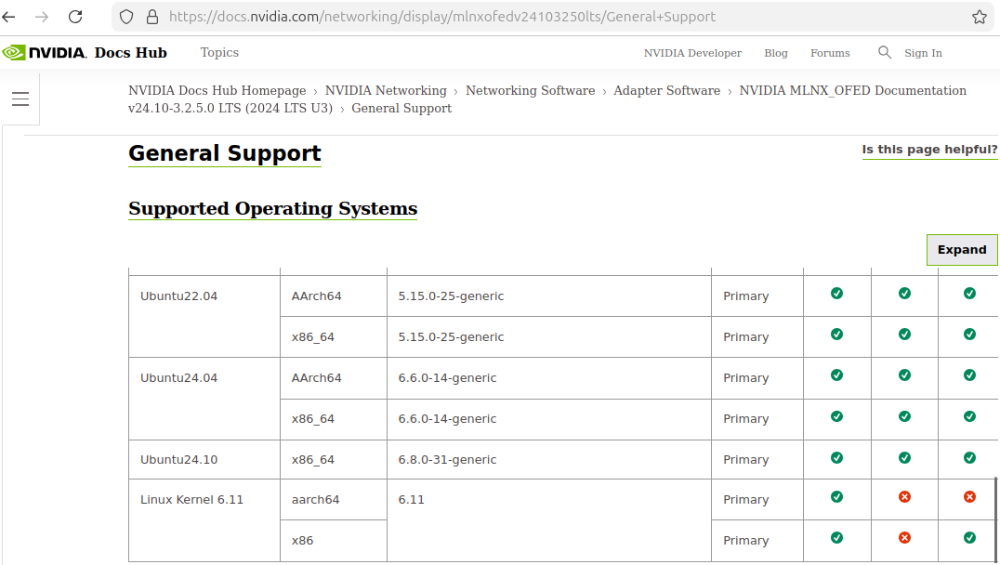
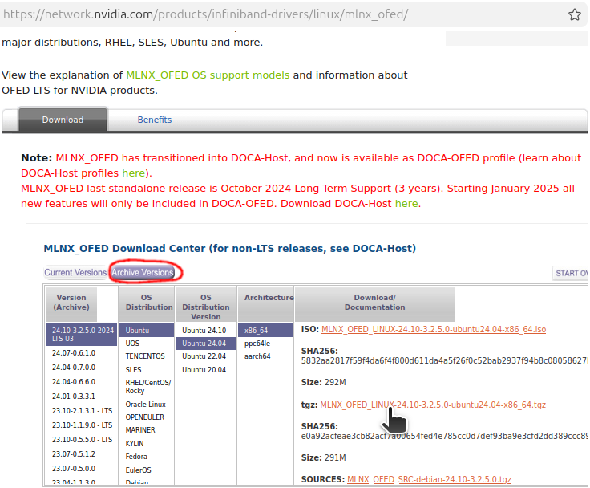

**Project Status**: *Work-in-Progress* - Patches recreate **Kcctech-git**'s work but `install.pl` does not properly enable Innova-2 FPGA support during a full install.


# Disclaimer

This repository contains experimental patches and notes created as part of a research and bring-up effort to run a Mellanox Innova 2 Flex FPGA card on modern Mellanox OFED (24.10).

The primary goal of the project was to restore FPGA-related functionality that existed in older Mellanox OFED releases (around OFED 5.2) and make it work on a modern kernel. This goal has been achieved: the Mellanox userspace tools build and run, and the FPGA on the Innova 2 Flex card can be successfully programmed using standard Mellanox utilities.

The work is based on analysis of publicly available source code from Mellanox open repositories, historical OFED versions, and limited reverse-engineering. No proprietary or confidential information is used.

This project is not an official solution and is not affiliated with, endorsed by, or supported by NVIDIA, Mellanox, AMD, or Xilinx.

The code is shared in the spirit of open research and community collaboration. Testing coverage is limited, and behavior may vary across kernel versions, distributions, and hardware platforms.

This repository is intended for research, educational, and experimental use only. Production use is strongly discouraged.

Use at your own risk.


# Overview

Modern Mellanox OFED releases no longer include FPGA-related functionality for Innova 2 Flex cards. This repository restores that support by backporting relevant driver components from OFED 5.2 into a modern OFED 24.10 codebase.

The primary goal of this project was to:
 - Run a Mellanox Innova 2 Flex card on the latest LTS Ubuntu Release
 - Use `innova_2_flex_open_18_12` Bundle
 - Successfully build and run Mellanox userspace utilities
 - Program the FPGA using Mellanox tools

This goal has been achieved.


# Motivation

Innova 2 Flex boards (Kintex UltraScale+ XCKU15P) are still available on the secondary market and offer a powerful FPGA platform with PCIe and high-speed transceivers.

However, official FPGA support was removed from newer OFED releases.

This project restores that functionality for experimentation and research on modern kernels and ARM platforms.


# Tested Configuration

 - Board: Mellanox Innova 2 Flex (Morse) MNV303212A-ADLT
 - Host: x64 System with 16GB DDR4 Memory
 - Architecture: x64
 - OS: Ubuntu 24.04.4
 - Kernel: 6.8.0-31
 - OFED base: MLNX OFED 24.10 3.2.5.0
 - Open Bundle: innova_2_flex_open_18_12

Other configurations may work but are untested.


# System Setup

Install [Ubuntu 24.04.4 Desktop amd64](https://releases.ubuntu.com/24.04.4/) and update and upgrade all packages:
```
sudo apt-get update
sudo apt-get upgrade
```

Install Linux Kernel `6.8.0-31-generic` which is the version [officially supported by `MLNX_OFED 24.10-3.2.5.0`](https://docs.nvidia.com/networking/display/mlnxofedv24103250lts/General+Support):



```
sudo apt-get install   linux-buildinfo-6.8.0-31-generic \
       linux-cloud-tools-6.8.0-31-generic linux-headers-6.8.0-31-generic \
       linux-image-6.8.0-31-generic linux-modules-6.8.0-31-generic \
       linux-modules-extra-6.8.0-31-generic linux-tools-6.8.0-31-generic \
       linux-cloud-tools-6.8.0-31 linux-cloud-tools-common \
       linux-headers-6.8.0-31 linux-tools-6.8.0-31
```

`sudo gnome-text-editor /etc/default/grub` and edit GRUB's configuration to boot the correct kernel:
```
### change timeout to 3s and add a menu
#GRUB_DEFAULT=0
GRUB_DEFAULT="Advanced options for Ubuntu>Ubuntu, with Linux 6.8.0-31-generic"
GRUB_TIMEOUT_STYLE=menu
GRUB_HIDDEN_TIMEOUT_QUIET=false
GRUB_TIMEOUT=3
GRUB_DISTRIBUTOR=`lsb_release -i -s 2> /dev/null || echo Debian`
GRUB_CMDLINE_LINUX_DEFAULT=""
GRUB_CMDLINE_LINUX="net.ifnames=0 biosdevname=0"
```

Update GRUB and reboot:
```
sudo update-grub
sudo reboot
```

List all installed Linux Kernels:
```
dpkg -l | grep linux-image | grep "^ii"
```

Remove all kernels that are **not** `6.8.0-31-generic` to prevent incompatible modules from failing to build. My system had `6.14.0-27-generic` and `6.17.0-14-generic`:
```
sudo apt remove \
   linux-headers-6.14.0-27-generic \
   linux-image-6.14.0-27-generic linux-modules-6.14.0-27-generic \
   linux-modules-extra-6.14.0-27-generic linux-tools-6.14.0-27-generic \
   \
   linux-headers-6.17.0-14-generic \
   linux-image-6.17.0-14-generic linux-modules-6.17.0-14-generic \
   linux-modules-extra-6.17.0-14-generic linux-tools-6.17.0-14-generic

sudo apt autoremove
sudo reboot
```

Mark the kernel modules so that they cannot be removed or updated:
```
sudo apt-mark hold  linux-buildinfo-6.8.0-31-generic \
   linux-cloud-tools-6.8.0-31 linux-cloud-tools-6.8.0-31-generic \
   linux-headers-6.8.0-31 linux-headers-6.8.0-31-generic \
   linux-image-6.8.0-31-generic linux-modules-6.8.0-31-generic \
   linux-modules-extra-6.8.0-31-generic linux-tools-6.8.0-31 \
   linux-tools-6.8.0-31-generic
```


Install tools that will be required on the system:
```
sudo apt install  7zip-standalone alien amd64-microcode apt \
  autoconf automake autotools-dev binfmt-support \
  binutils-riscv64-unknown-elf binwalk bison bpfcc-tools \
  build-essential bzip2 chrpath clang clinfo cmake coreutils \
  curl cycfx2prog cython3 dc debhelper debootstrap devmem2 \
  devscripts dh-autoreconf dh-dkms dh-python dkms dos2unix \
  doxygen dpdk dwarves elfutils fakeroot flashrom flex fxload \
  gcc gcc-multilib gcc-riscv64-unknown-elf gdb gedit gfortran \
  gfortran-multilib ghex git gnuplot graphviz gtkterm gtkwave \
  htop hwdata hwinfo intel-microcode intel-opencl-icd \
  kcachegrind libaio1t64 libaio-dev libasm1t64 libbpfcc \
  libbpfcc-dev libbsd0 libc6 libc6-dev libcap-dev \
  libcharon-extauth-plugins libclang-dev libcunit1 \
  libcunit1-dev libdb-dev libdevmapper-dev libdrm-dev \
  libdw1t64 libdwarf++0t64 libedit-dev libegl1-mesa-dev \
  libelf++0t64 libelf1t64 libelf-dev libelfin-dev libfdt1 \
  libfdt-dev libfontconfig1-dev libfreetype-dev libftdi1 \
  libftdi1-dev libftdi1-doc libftdi-dev libfuse2t64 \
  libfuse-dev libgfortran5 libglib2.0-0t64 libglib2.0-bin \
  libglib2.0-data libglib2.0-dev libhugetlbfs-bin libipsec-mb1 \
  libipsec-mb-dev libisal2 libisal-dev libjansson4 libjpeg-dev \
  liblzma-dev libmfx1 libmfx-dev libmfx-tools libmnl0 \
  libmnl-dev libmount-dev libncurses6 libncurses-dev \
  libnl-3-200 libnl-3-dev libnl-route-3-200 \
  libnl-route-3-dev libnuma-dev libopencl-clang14 \
  libopencl-clang-14-dev libpci-dev libproc2-dev \
  libreadline-dev libselinux1 libselinux1-dev libsgutils2-dev \
  libssl-dev libstdc++6 libstdc++-9-dev-riscv64-cross \
  libstdc++-9-pic-riscv64-cross libstrongswan \
  libstrongswan-standard-plugins libsystemd0 libsystemd-dev \
  libtiff6 libtiff-dev libtinfo6 libtool libudev-dev \
  libunbound8 libunbound-dev libunwind8 libunwind-dev \
  libusb-1.0-0-dev libusb-dev libxext-dev libxfixes-dev \
  libxft-dev linux-bpf-dev llvm-dev linux-doc logrotate \
  lsb-base make mdevctl meld mesa-opencl-icd meson \
  module-assistant ninja-build ntpdate nvme-cli ocl-icd-dev \
  ocl-icd-libopencl1 ocl-icd-opencl-dev opencl-headers \
  openjdk-17-jdk openjdk-17-jre openocd opensbi openssl \
  openvswitch-switch pahole pandoc pciutils perl pkg-config \
  procps python3 python3-all python3-attr python3-automat \
  python3-binwalk python3-bpfcc python3-constantly python3-dev \
  python3-docutils python3-ftdi1 python3-hamcrest \
  python3-hyperlink python3-incremental python3-openpyxl \
  python3-openssl python3-pip python3-pkgconfig python3-pyasn1 \
  python3-pyasn1-modules python3-pyelftools python3-scapy \
  python3-service-identity python3-setuptools python3-six \
  python3-sphinx python3-twisted python3-zope.interface \
  python-is-python3 quilt sg3-utils squashfs-tools \
  squashfs-tools-ng squashfuse strongswan strongswan-charon \
  strongswan-libcharon strongswan-starter sudo swig tcl-dev \
  thermald tk-dev udev v4l2loopback-dkms v4l2loopback-utils \
  valgrind vbindiff vtun xc3sprog xxd zlib1g zlib1g-dev
```


Need a personal [signing key](https://github.com/andikleen/simple-pt/issues/8#issuecomment-813438385) for compiled kernel modules. Run `sudo ls` to prime `sudo` then copy and paste the following into a command terminal and it should generate a key configuration.
```
cd /lib/modules/$(uname -r)/build/certs

sudo tee x509.genkey > /dev/null << 'EOF'
[ req ]
default_bits = 4096
distinguished_name = req_distinguished_name
prompt = no
string_mask = utf8only
x509_extensions = myexts
[ req_distinguished_name ]
CN = Modules
[ myexts ]
basicConstraints=critical,CA:FALSE
keyUsage=digitalSignature
subjectKeyIdentifier=hash
authorityKeyIdentifier=keyid
EOF
```

Generate custom key and reboot.
```
sudo openssl req -new -nodes -utf8 -sha512 -days 36500 -batch -x509 -config x509.genkey -outform DER -out signing_key.x509 -keyout signing_key.pem
sudo reboot
```


## Install MLNX_OFED

Download the `tgz` of [`MLNX_OFED 24.10-3.2.5.0`](https://network.nvidia.com/products/infiniband-drivers/linux/mlnx_ofed/) for Ubuntu 24.04.



Extract `MLNX_OFED`:
```
cd ~
tar -xf MLNX_OFED_LINUX-24.10-3.2.5.0-ubuntu24.04-x86_64.tgz
```

Clone this repository:
```
cd ~
git clone https://github.com/mwrnd/Innova2Flex_OFED_Support.git
```

Modify the kernel driver source package with this repository's updates. The bulk of the changes are included as a `backports` patch.
```
cd ~
cd MLNX_OFED_LINUX-24.10-3.2.5.0-ubuntu24.04-x86_64/src
tar -xf MLNX_OFED_SRC-24.10-3.2.5.0.tgz
cd MLNX_OFED_SRC-24.10-3.2.5.0/SOURCES/
tar -xf mlnx-ofed-kernel_24.10.OFED.24.10.3.2.5.1.orig.tar.gz
cd mlnx-ofed-kernel-24.10.OFED.24.10.3.2.5.1/

cp ~/Innova2Flex_OFED_Support/0359-Kcc-patches-for-Innova2-support-ported-from-OFED-5.2.patch  backports/
cp ~/Innova2Flex_OFED_Support/0001-Update-build-with-Innova2-FPGA-support.patch .

patch -p1  < 0001-Update-build-with-Innova2-FPGA-support.patch
rm 0001-Update-build-with-Innova2-FPGA-support.patch
```


TODO: At this point if you recompress the source code and then run `install.pl` it should but does not properly build the modules. For now, build the modules and test manually.


Run configure:
```
./configure \
    --with-mlx5_core-mod \
    --with-innova-flex \
    --with-mlxfw-mod \
    --without-debug-info \
    --with-linux=/lib/modules/$(uname -r)/build \
    --kernel-version=$(uname -r)

sudo mkdir -p /lib/modules/$(uname -r)/updates/patched_ofed
sudo cp compat/mlx_compat.ko /lib/modules/$(uname -r)/updates/patched_ofed/
sudo cp net/mlxdevm/mlxdevm.ko /lib/modules/$(uname -r)/updates/patched_ofed/
sudo cp drivers/net/ethernet/mellanox/mlxfw/mlxfw.ko /lib/modules/$(uname -r)/updates/patched_ofed/
sudo cp drivers/net/ethernet/mellanox/mlx5/core/mlx5_core.ko /lib/modules/$(uname -r)/updates/patched_ofed/
sudo cp drivers/net/ethernet/mellanox/mlx5/fpga/mlx5_fpga_tools.ko /lib/modules/$(uname -r)/updates/patched_ofed/
```

```
sudo depmod -a
```

### Unload Stock Mellanox Modules
```
sudo modprobe -r mlx5_fpga_tools mlx5_core mlxfw mlxdevm mlx_compat
```

### Load Patched Modules
```
sudo insmod /lib/modules/$(uname -r)/updates/patched_ofed/mlx_compat.ko
sudo insmod /lib/modules/$(uname -r)/updates/patched_ofed/mlxdevm.ko
sudo insmod /lib/modules/$(uname -r)/updates/patched_ofed/mlxfw.ko
sudo insmod /lib/modules/$(uname -r)/updates/patched_ofed/mlx5_core.ko
sudo insmod /lib/modules/$(uname -r)/updates/patched_ofed/mlx5_fpga_tools.ko
```


## Install Innova2 FPGA Utilities

Download the [Innova2 Support Utilities Bundle `mlnx-lnvgy_utl_nic_in2-18.12_linux_x86-64.tgz`](https://support.lenovo.com/us/en/downloads/ds539910) from Lenovo.


```
cd
sha256sum mlnx-lnvgy_utl_nic_in2-18.12_linux_x86-64.tgz
echo 0857eee574159fa3e61aea4d133c74d9236f409e52a0f7ed146bbc32b00765d0 should be the checksum
tar -xf mlnx-lnvgy_utl_nic_in2-18.12_linux_x86-64.tgz
```

Build the BOPE driver:
```
cd Innova_2_Flex_Open_18_12_Lenovo/driver
cp ~/Innova2Flex_OFED_Support/0001-Fix-THIS_MODULE-error-in-mlx_fpga_bope.patch .
patch -p1  < 0001-Fix-THIS_MODULE-error-in-mlx_fpga_bope.patch
make
sudo depmod -a
```

Build the Flex Driver app:
```
cd ~/Innova_2_Flex_Open_18_12_Lenovo/app/
make
```

Install `mst` firmware utilities:
```
cd ~/MLNX_OFED_LINUX-24.10-3.2.5.0-ubuntu24.04-x86_64/DEBS
sudo dpkg -i mft_4.30.1-1210_amd64.deb
```


# Verification

Check dmesg:
```
dmesg | grep FPGA
```
Expected output:
```
[    1.040638] mlx5_core 0000:04:00.0: FPGA: Status 0; Admin image 0; Oper image 0
[    1.040656] mlx5_core 0000:04:00.0: FPGA: FPGA card Morse:2
[    1.602211] mlx5_core 0000:04:00.1: FPGA: Status 0; Admin image 0; Oper image 0
[    1.602218] mlx5_core 0000:04:00.1: FPGA: FPGA card Morse:2
[   11.378737] Call normal FPGA init
[   11.378741] Initializing FPGA
[   11.385147] FPGA: Status 0; Admin image 0; Oper image 0
[   11.385157] FPGA: FPGA card Morse:2
```

You should see FPGA initialization messages.


### Initialize MST:
```
sudo mst start
sudo flint -d /dev/mst/mt4119_pciconf0 q
```

### Build device driver:
```
cd ~/Innova_2_Flex_Open_18_12_Lenovo/driver
sudo ./make_device
```

You should see:
```
chardev /dev/mlx_fpga_bope0 created
```
I made a snippet to initialize it by single command:
```
sudo mst start && sudo flint -d /dev/mst/mt4119_pciconf0 q &&
cd ~/Distrib/Open_bundle/Innova_2_Flex_Open_18_12/driver/ && sudo ./make_device &&
sudo insmod /usr/lib/modules/`uname -r`/updates/patched_ofed/mlx5_fpga_tools.ko
```
# Running Userspace Application
```
cd ~/Innova_2_Flex_Open_18_12_Lenovo/app
sudo ./innova2_flex_app -v
```

Expected result:
 - FPGA accessible
 - Board type: Morse
 ```
 Verbosity:        1
 BOPE device:      None
 ConnectX device:  None
 ConnectX device: /dev/0000:04:00.0_mlx5_fpga_tools
 BOPE device:     None
 Scheduled image:  User Image
 Running image:    User Image(Success)
 Type of board: Morse

Jump-to-Innova2-User menu
------------------
[ 1 ] Set Innova2_Flex image active (reboot required)
[ 2 ] Set User image active
[ 3 ] Enable JTAG Access - no thermal status
[ 4 ] Read FPGA thermal status
[ 5 ] Reload User image
[99 ] Exit
Your choice:
```

Refer to the [innova2_flex_xcku15p](https://github.com/mwrnd/innova2_flex_xcku15p_notes?tab=readme-ov-file#loading-a-user-image) project for further notes on working with the Innova2.


# Once the TODO is Fixed

Recompress the OFED driver:
```
cd ..
rm mlnx-ofed-kernel_24.10.OFED.24.10.3.2.5.1.orig.tar.gz
tar -czf mlnx-ofed-kernel_24.10.OFED.24.10.3.2.5.1.orig.tar.gz  mlnx-ofed-kernel-24.10.OFED.24.10.3.2.5.1
rm -Rf mlnx-ofed-kernel-24.10.OFED.24.10.3.2.5.1/
```

Run the [install program](https://docs.nvidia.com/networking/display/mlnxofedv24103250lts/Installing+the+Driver#src-4047367757_InstallingtheDriver-InstallingOFEDonCommunityOperatingSystems) to build and install from the updated source packages:
```
cd ~/MLNX_OFED_LINUX-24.10-3.2.5.0-ubuntu24.04-x86_64/src/MLNX_OFED_SRC-24.10-3.2.5.0
sudo ./install.pl -vvv --all --fwctl
```

Install `mst` firmware utilities:
```
cd ~/MLNX_OFED_LINUX-24.10-3.2.5.0-ubuntu24.04-x86_64/DEBS
sudo dpkg -i mft_4.30.1-1210_amd64.deb
```


Place all the installed `MLNX_OFED` programs on *hold* so that they are not removed or updated:
```
sudo  apt-mark  hold   ofed-scripts mlnx-tools \
  mlnx-ofed-kernel-utils mlnx-ofed-kernel-dkms iser-dkms \
  isert-dkms srp-dkms rdma-core libibverbs1 ibverbs-utils \
  ibverbs-providers libibverbs-dev libibverbs1-dbg \
  libibumad3 libibumad-dev ibacm librdmacm1 rdmacm-utils \
  librdmacm-dev ibdump libibmad5 libibmad-dev libopensm \
  opensm opensm-doc libopensm-devel libibnetdisc5 \
  infiniband-diags mft kernel-mft-dkms perftest ibutils2 \
  ibsim ibsim-doc ucx sharp hcoll knem-dkms knem openmpi \
  mpitests xpmem-dkms xpmem libxpmem0 libxpmem-dev dpcp \
  srptools mlnx-ethtool mlnx-iproute2 rshim ibarr
```

Restart your computer and confirm the kernel modules and OFED installed correctly:
```
sudo dkms status
ofed_info -n
```

